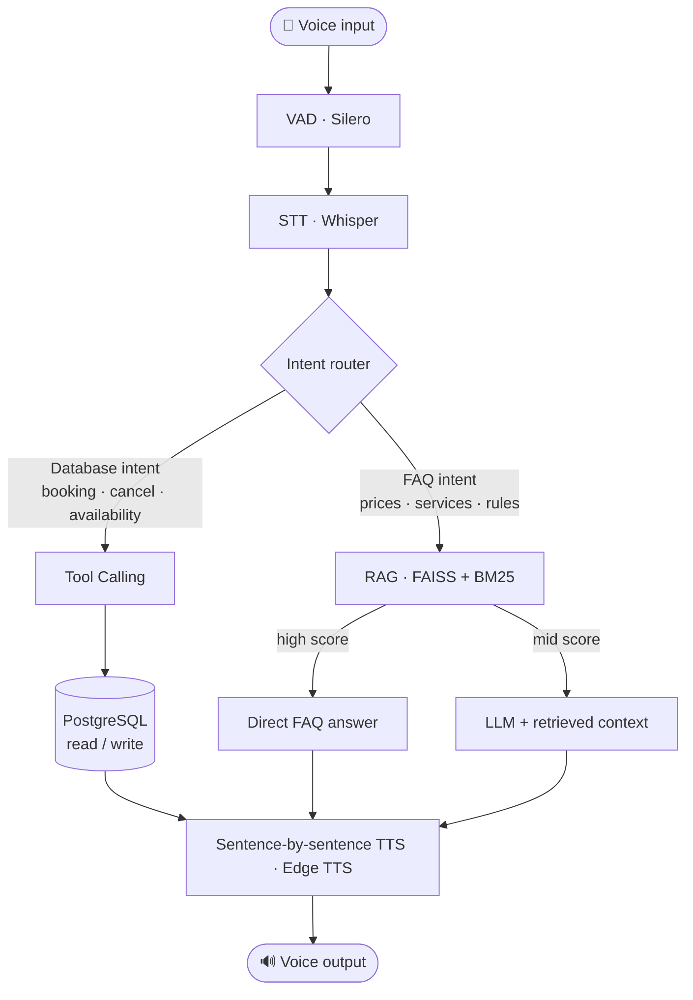

# 🎙️ AzVoice AI — Astana Hotel 

> **An end-to-end Azerbaijani voice assistant that answers hotel calls in real time — powered by Speech-to-Text, a Large Language Model with tool calling, Retrieval-Augmented Generation, and Text-to-Speech.**

The assistant, **İbrahim**, listens to the caller in Azerbaijani, understands the request, looks up answers (hotel knowledge base or live database), and speaks the reply back sentence-by-sentence with minimal latency.

---

## 🚀 Developed by Team **ASTANA**

| Member | Role |
|--------|------|
| **Orkhan Nuriyev** | System Architecture, Voice Assistant Pipeline, Backend Integration |
| **Ibrahim Suleymanov** | LLM Integration, Prompt Engineering, Speech Processing |
| **Esli Ehmedova** | Demo Development, Web Interface, Frontend Integration |
| **Ulviyye Eliyeva** | Data Collection & Preprocessing, Testing & Evaluation, Documentation |

---

## ✨ Features

- **Speech-to-Text (STT):** Converts Azerbaijani speech into text.
- **AI-Powered Responses:** Context-aware answers from an LLM with hotel tool calling.
- **Text-to-Speech (TTS):** Natural-sounding Azerbaijani voice.
- **Real-Time Conversation:** Low-latency, sentence-streamed voice interaction.
- **Web Avatar:** A talking video avatar synced to the assistant's speech.

---

## 📌 Problem Statement

How can we build a fast and accurate Azerbaijani voice assistant that understands spoken language, generates intelligent responses, and delivers natural speech in real time? This project integrates STT, an LLM, and TTS into a unified, end-to-end conversational AI pipeline for a real use case: a hotel call center.

## 💡 Why It Matters

High-quality voice assistants for the Azerbaijani language are still limited. This project improves accessibility and human-computer interaction by enabling natural, low-latency voice conversations in Azerbaijani — a foundation for customer support, virtual assistants, and other voice-enabled services.

---

## 🧠 How It Works



The system runs in **two modes**, switchable at runtime from the admin panel:

| Mode | STT | LLM | TTS |
|------|-----|-----|-----|
| **Full Local (GPU)** | faster-whisper large-v3 (CUDA) | Ollama / gemma4:e4b | Edge TTS (az-AZ) |
| **API Hybrid (no GPU)** | Groq Cloud whisper-large-v3 | Google Gemini API | Edge TTS (az-AZ) |

Multi-layer fallbacks keep the line from ever going silent (Groq → local Whisper, Gemini → local Ollama → direct RAG answer, Edge TTS → gTTS).

---

## 🛠️ Tech Stack

- **STT:** faster-whisper (large-v3), Groq Cloud API
- **VAD:** Silero VAD
- **LLM:** Ollama (gemma4:e4b), Google Gemini — with tool calling
- **RAG:** FAISS (dense, BAAI/bge-m3) + BM25 hybrid search
- **TTS:** Edge TTS (az-AZ-BabekNeural), gTTS fallback
- **Backend:** Python, FastAPI + WebSocket
- **Database:** PostgreSQL 16 + pgvector
- **Auth:** JWT, PBKDF2-SHA256, role-based access control (RBAC)
- **Deploy:** Docker / docker-compose

---

## 📂 Repository Structure

```
.
├── src/                 # Python source
│   ├── main.py          # Local mode entry point (microphone)
│   ├── config.py        # Central configuration
│   ├── audio/ vad/ stt/ # Capture, voice activity detection, transcription
│   ├── llm/ knowledge/  # LLM backend (RAG + tool calling), FAISS/BM25 RAG
│   ├── tts/ db/         # Speech synthesis, PostgreSQL tools & memory
│   ├── pipeline/ web/   # Local orchestration, FastAPI + WebSocket server
│   └── admin/           # Admin REST API, auth, DB CRUD, services
├── knowledge/           # FAQ knowledge base (JSON)
├── vector_store/        # Prebuilt FAISS index + metadata
├── database/            # docker-compose + SQL schema, seed, triggers
├── character/           # Web avatar video
├── scripts/ tests/      # Benchmarks and unit tests
├── docs/                # RUN, DEPLOY, ADMIN guides
└── requirements.txt
```

---

## ⚙️ Getting Started

> 📖 **New here? Go straight to [Setup.md](Setup.md)** — it has full step-by-step instructions for both **Windows** and **macOS / Linux**, covering **API mode** and **GPU/local mode**.

The system supports two operating modes — pick whichever fits your hardware:

| | API Mode | GPU / Local Mode |
|---|---|---|
| **GPU required?** | ❌ No | ✅ Yes (CUDA) |
| **STT** | Groq Cloud (`whisper-large-v3`) | faster-whisper large-v3 (local) |
| **LLM** | Google Gemini API | Ollama `gemma4:e4b` (local) |
| **Internet required?** | ✅ Yes | ❌ No (after first download) |
| **Keys needed** | `GROQ_API_KEY` + `GEMINI_API_KEY` | none |

---

### 🌐 Quick-start — API Mode (no GPU needed)

**Windows (PowerShell):**
```powershell
# 1. Copy and fill in your API keys
Copy-Item .env.example .env
# Open .env and set:  STT_PROVIDER=groq  LLM_PROVIDER=gemini
# + your GROQ_API_KEY and GEMINI_API_KEY

# 2. Create venv & install packages
python -m venv .venv
.venv\Scripts\activate
pip install -r requirements.txt

# 3. Start the database
docker compose up -d

# 4. Start the server
.venv\Scripts\python -m uvicorn web.server:app --app-dir src --port 8000
```

**macOS / Linux:**
```bash
# 1. Copy and fill in your API keys
cp .env.example .env
# Open .env and set:  STT_PROVIDER=groq  LLM_PROVIDER=gemini
# + your GROQ_API_KEY and GEMINI_API_KEY

# 2. Create venv & install packages
python3 -m venv .venv
source .venv/bin/activate
pip install -r requirements.txt

# 3. Start the database
docker compose up -d

# 4. Start the server
.venv/bin/python -m uvicorn web.server:app --app-dir src --port 8000
```

---

### 💻 Quick-start — GPU / Local Mode (CUDA GPU required)

> **Requirements:** NVIDIA GPU with CUDA 12.1+, [Ollama](https://ollama.com) installed and running.

**Windows (PowerShell):**
```powershell
# 1. Copy env file — local mode is already the default
Copy-Item .env.example .env
# Optionally open .env and verify:  STT_PROVIDER=local  LLM_PROVIDER=local

# 2. Pull the LLM model into Ollama (one-time, ~8 GB)
ollama pull gemma4:e4b

# 3. Create venv & install packages (CUDA build is pulled automatically)
python -m venv .venv
.venv\Scripts\activate
pip install -r requirements.txt

# 4. Start the database
docker compose up -d

# 5. Start the server
.venv\Scripts\python -m uvicorn web.server:app --app-dir src --port 8000
```

**macOS / Linux:**
```bash
# 1. Copy env file
cp .env.example .env
# Open .env and verify:  STT_PROVIDER=local  LLM_PROVIDER=local

# 2. Pull the LLM model into Ollama (one-time, ~8 GB)
ollama pull gemma4:e4b

# 3. Create venv & install packages
python3 -m venv .venv
source .venv/bin/activate
# On macOS, install CPU-only torch (no CUDA on Apple Silicon):
pip install torch==2.5.1 torchaudio==2.5.1 --index-url https://download.pytorch.org/whl/cpu
pip install -r requirements.txt --ignore-requires-python

# 4. Start the database
docker compose up -d

# 5. Start the server
.venv/bin/python -m uvicorn web.server:app --app-dir src --port 8000
```

> **Note:** faster-whisper large-v3 (~3 GB) is downloaded from HuggingFace automatically on the **first run** — not via `ollama pull`. `ollama pull gemma4:e4b` is only for the LLM.

Then open **http://localhost:8000** in your browser.

**More guides:** [Setup.md](Setup.md) _(full cross-platform walkthrough)_ · [docs/RUN.md](docs/RUN.md) · [docs/DEPLOY.md](docs/DEPLOY.md) · [docs/ADMIN.md](docs/ADMIN.md)

### 🔑 Environment Variables

Set these in `.env` (see `.env.example` — **never commit `.env`**):

| Variable | Purpose |
|----------|---------|
| `STT_PROVIDER` / `LLM_PROVIDER` | `local`, `groq`, or `gemini` |
| `GROQ_API_KEY` | Groq Cloud STT (API mode) |
| `GEMINI_API_KEY` | Google Gemini LLM (API mode) |
| `WHISPER_MODEL` / `WHISPER_DEVICE` | Local Whisper settings |
| `OLLAMA_URL` | Local Ollama endpoint |
| `DB_PASSWORD` | PostgreSQL password |

---

## 📋 Project Progress

| Component | Status | Notes |
|-----------|:------:|-------|
| Voice Activity Detection | ✅ Working | Silero VAD integrated |
| Speech-to-Text | ✅ Working | faster-whisper + Groq API |
| Large Language Model | ✅ Working | gemma4:e4b via Ollama / Gemini API |
| Retrieval-Augmented Generation | ✅ Working | FAISS + BM25 hotel knowledge base |
| Text-to-Speech | ✅ Working | Edge TTS (Azerbaijani voices) |
| End-to-End Voice Pipeline | ✅ Working | STT → RAG → LLM → TTS |
| Tool Calling | ✅ Working | 10 PostgreSQL hotel tools |
| Web Interface + Avatar | ✅ Working | FastAPI + WebSocket, talking avatar |
| Admin Panel (RBAC) | ✅ Working | Auth, dashboard, DB CRUD, prompt versioning |
| Performance Evaluation | ✅ Working | Latency + response quality benchmarked |
| Docker Deployment | ✅ Working | App + DB + Ollama compose |
| Hotel Knowledge Base Expansion | 🔧 In Progress | Dataset and JSON improvements |
| Monitoring Dashboard | ⏳ Planned | Conversation analytics and logs |
| Final Presentation | ⏳ Planned | Demo slides and project overview |

---

## 🔒 Security Note

API keys and passwords live in `.env`, which is git-ignored. Never commit real credentials. If a key is ever exposed, rotate it in the provider console.

---

## 📄 License

Released under the MIT License — see [LICENSE](LICENSE).
